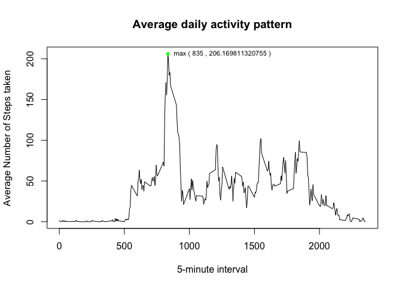

## Loading and preprocessing the data


```r
# Unzip the file and read the csv 
# Convert date column from factor into date format 
unzip("activity.zip")
df <- read.csv("activity.csv")
df$date <- as.Date(df$date,format="%Y-%m-%d")
```

## What is mean total number of steps taken per day?

```r
# Compute sum of steps per day, save it as a dataframe
# Plot histogram of total steps per day 
totalStep <- with(df, tapply(steps, date, sum, na.rm = TRUE))
df_totalStep <-
        data.frame(date = names(totalStep), totalStep = totalStep)
hist(df_totalStep$totalStep, main = "Histogram of Total Number of Steps Taken Each Day (without NA)", xlab =
             "Total Number of Steps Per Day")
```

<!-- -->

#### Mean of total number of steps taken per day (without NA)

```r
meanStep <- mean(df_totalStep$totalStep)
print(meanStep)
```

```
## [1] 9354.23
```

#### Median of total number of steps taken per day (without NA)

```r
medianStep <- median(df_totalStep$totalStep)
print(medianStep)
```

```
## [1] 10395
```

## What is the average daily activity pattern?

```r
# Compute the average steps per interval
# Convert factor to numeric so that the x-axis could be plotted correctly 
averageStep <- with(df, tapply(steps, interval, mean, na.rm = TRUE))
df_averageStep <-
        data.frame(interval = names(averageStep), averageStep = averageStep)
df_averageStep$interval <-
        as.numeric(as.character(df_averageStep$interval))

# Plot the line graph with the correct title,x-label,y-label
with(
        df_averageStep,
        plot(
                interval,
                averageStep,
                type = "l",
                main = "Average daily activity pattern",
                xlab = "5-minute interval",
                ylab = "Average Number of Steps taken"
        )
)

# Compute the maximum point so that the maximum value can be shown on the graph
max_point <- subset(df_averageStep, averageStep == max(averageStep))
max_point_label <-
        paste("max", "(", max_point$interval, ",", max_point$averageStep, ")")
points(max_point$interval,
       max_point$averageStep,
       pch = 20,
       col = "green")
text(
        max_point$interval,
        max_point$averageStep,
        labels = max_point_label,
        cex = 0.7,
        pos = 4
)
```

<!-- -->

#### 5-minute interval that contains the maximum number of steps

```r
max_point$interval
```

```
## [1] 835
```

## Imputing missing values
#### Total number of missing values in the dataset 

```r
sum(is.na(df$steps))
```

```
## [1] 2304
```
#### Fill NA values with the mean of interval 

```r
# Merge original dataframe with averagestep (average steps of each interval) dataframe 
df_new <- merge(df,df_averageStep)

# If the step of any interval is NA, use the average steps, else use the original value
df_new$steps <- ifelse(is.na(df_new$steps),df_new$averageStep,df_new$steps)

# Then drop the averageStep column
df_new <- subset(df_new, select= -c(averageStep))
```


```r
# Plot the histogram
totalStepNew <- with(df_new, tapply(steps, date, sum, na.rm = TRUE))
df_totalStepNew <-
  data.frame(date = names(totalStepNew), totalStep = totalStepNew)
hist(df_totalStepNew$totalStep, main = "Histogram of Total Number of Steps Taken Each Day (NA replaced)", xlab =
       "Total Number of Steps Per Day")
```

<!-- -->

#### Mean of total number of steps taken per day (NA replaced)

```r
meanStepNew <- mean(df_totalStepNew$totalStep)
print(meanStepNew)
```

```
## [1] 10766.19
```

#### Median of total number of steps taken per day (NA replaced)

```r
medianStepNew <- median(df_totalStepNew$totalStep)
print(medianStepNew)
```

```
## [1] 10766.19
```

The histogram for total number of steps taken each day after imputing data **show a more normally distributed graph** compared with the first part of assignment where most of the observations are around the central peak and number taper off equally in both directions.  
  
Both mean and median have **increased** after imputing data.  
**Mean** With NA removed : 9354.2295082  
**Mean** With NA replaced : 10766.1886792  
**Median** with NA removed : 10395  
**Median** with NA replaced : 10766.1886792  
Interestingly, mean and median are the same when NA is replaced with the mean of each interval.

## Are there differences in activity patterns between weekdays and weekends?

```r
# Add a new column called day that differentiate between weekend and weekday
# Split into weekday and weekend dataframe
df_new$day <-
  ifelse(
    weekdays(df_new$date) == "Saturday" |
      weekdays(df_new$date) == "Sunday",
    "weekend",
    "weekday"
  )
```
#### Compute average steps for weekday dataset 

```r
df_weekday <- subset(df_new, day == "weekday")
weekday_averageStep <- with(df_weekday, tapply(steps, interval, mean, na.rm = TRUE))
df_weekday_averageStep <-
        data.frame(interval = names(weekday_averageStep), averageStep = weekday_averageStep)
df_weekday_averageStep$interval <-
        as.numeric(as.character(df_weekday_averageStep$interval))
```

#### Compute average steps for weekend dataset  

```r
df_weekend <- subset(df_new, day == "weekend")
weekend_averageStep <- with(df_weekend, tapply(steps, interval, mean, na.rm = TRUE))
df_weekend_averageStep <-
        data.frame(interval = names(weekend_averageStep), averageStep = weekend_averageStep)
df_weekend_averageStep$interval <-
        as.numeric(as.character(df_weekend_averageStep$interval))
```

#### Plot weekday and weekend plots within 1 column

```r
par(mfrow = c(2, 1))
# Plot the weekday plot
with(
        df_weekday_averageStep,
        plot(
                interval,
                averageStep,
                type = "l",
                main = "Average daily activity pattern (Weekday)",
                xlab = "5-minute interval",
                ylab = "Number of Steps",
                col="blue"
        )
)
#Plot the weekend plot
with(
        df_weekend_averageStep,
        plot(
                interval,
                averageStep,
                type = "l",
                main = "Average daily activity pattern (Weekend)",
                xlab = "5-minute interval",
                ylab = "Number of Steps",
                col="blue"
        )
)
```

<!-- -->
The above two graphs show that **weekday has a higher peak** in general but **weekend has a much more active lifestyle**, especially towards the evening.  
